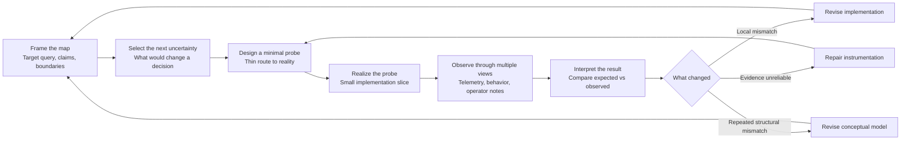
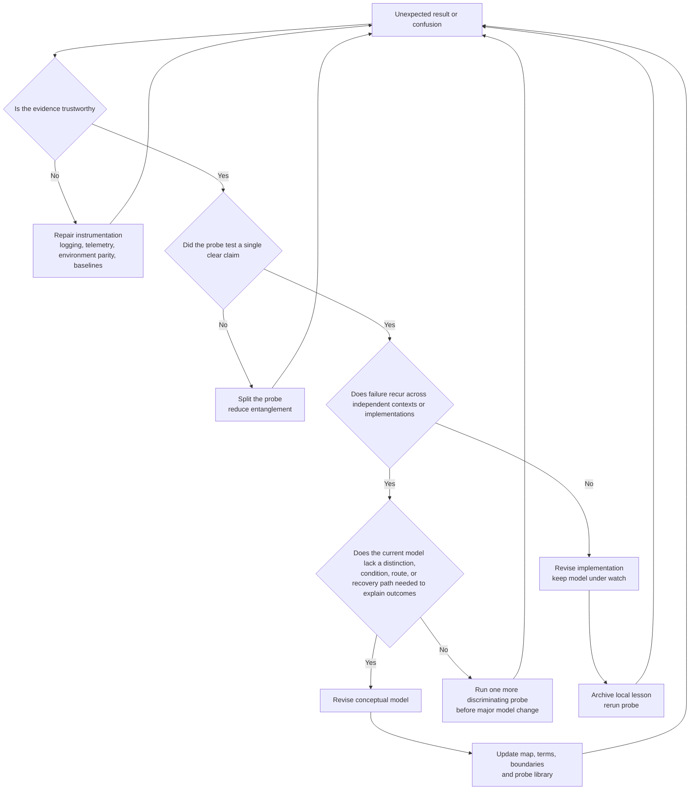

# Iterative Map-Centered Development Guidance

## Executive summary

This report proposes a lightweight, self-contained process for turning a conceptual framework of **admissibility maps, capabilities, reachability, invariants, selectors, and recoverability** into working systems without pretending that the conceptual model can be completed in advance. The central stance is that the framework should be used as a **navigation interface over reality**, not as a world-making engine: the map is a bounded representation that preserves distinctions relevant to action, measurement, repair, recovery, and future reachability, while remaining corrigible in contact with the world. In your source documents, this is the recurring distinction between **realized organization** and **representation**, the insistence that “no edge, no route,” and the treatment of views, capabilities, and recoverable distinctions as operational rather than merely semantic constructs. fileciteturn0file0 fileciteturn0file1 fileciteturn0file2 fileciteturn0file4 fileciteturn0file5 fileciteturn0file7

For complex work, the most defensible baseline is therefore **iterative, empirical, and incremental** rather than a one-shot design-and-build sequence. The Agile Manifesto prioritizes responding to change, customer collaboration, working software, and frequent delivery; the Scrum Guide explicitly frames work on complex problems as empirical, iterative, incremental, and driven by transparency, inspection, and adaptation; and DORA’s guidance emphasizes improving via smaller changes, baselining, and repeating the learning cycle rather than attempting prediction from first principles alone. citeturn3view0turn3view1turn3view2turn20view0turn5view0

The practical implication is simple: a good guidance document should not ask teams to “implement the framework” in the abstract. It should ask them to repeatedly do five things: **frame the map**, **choose the next decisive uncertainty**, **build the thinnest probe that can encounter reality**, **observe through multiple views**, and **decide whether to revise the model, the implementation, or the instrumentation**. This mirrors your own documents’ emphasis on observation populating the map, interaction tests exposing gaps, and corrected representations improving future navigation. fileciteturn0file0 fileciteturn0file4 fileciteturn0file5

A disciplined version of this process should default to **small batches, short feedback loops, explicit decision rules, and multi-dimensional measurement**. Scrum prefers shorter timescales for delivery and reflection; DORA warns against “one metric to rule them all” and against using measurement competitively; and the SPACE framework argues that productivity and progress cannot be reduced to a single activity metric but require balancing satisfaction, performance, activity, collaboration, and efficiency/flow. citeturn3view1turn5view0turn14view0

Because the user did not specify a team size or domain, the workflow below is written in **role form** rather than headcount form. In a small team, one person may play several roles; in a larger team, roles can be split. Implementation technologies such as **Kubernetes, cloud services, APIs, GUIs, and dashboards** appear here only as **probe infrastructure**: they are useful insofar as they create contact with reality, make state visible, and let the team run thin empirical tests. They are not the design center.

## Foundations for a map-centered process

A useful starting point is to make the report’s metaphysics explicit: **reality is already the implementation; the framework is the map**. Your documents repeatedly reject the idea that the framework creates the world. Instead, they define a queryable representation of realized organizations, transition schemas, constraints, capability filters, and recoverable paths. That means the primary design question is not “What can we name?” but “What claims are operationally grounded, under what conditions, with what measurable consequences, and with what route to recovery or reuse?” fileciteturn0file1 fileciteturn0file3 fileciteturn0file4

This matters because it changes what counts as progress. In a map-centered process, progress is not the accumulation of concepts, tickets, or infrastructure by itself. Progress is the reduction of **decision-relevant uncertainty**: the team can state which distinctions matter, which interactions are admissible, what local conditions enable them, what evidence would confirm or disconfirm them, and what future continuations become reachable if the probe succeeds. That orientation is strongly aligned with empiricism in Scrum and with GQM-style measurement logic, in which goals are refined into questions and then into metrics rather than the other way around. fileciteturn0file0 fileciteturn0file5 citeturn3view2turn20view0turn19search0

The immediate payoff of this framing is that it gives teams a principled way to avoid two common failure modes. The first is **map theater**: increasingly polished abstractions that are not tied to decisive probes. The second is **implementation theater**: extensive engineering activity without clarified claims, decision rules, or observable consequences. DORA’s process guidance and the SPACE framework both warn, in different ways, against mistaking visible activity or dashboard volume for actual performance, learning, or improvement. citeturn5view0turn14view0

A good self-contained guidance document should therefore define three non-negotiables early. First, every important claim must be linked to a **route claim** or an explicit admission that no accepted route yet exists. Second, every iteration must contain at least one **thin empirical probe**. Third, every review must close with a **disposition**: keep the model and refine implementation; keep the implementation direction and revise the model; or repair measurement first because the evidence is not trustworthy. That structure matches your source material’s insistence on admissible edges, local enablement, and correction through observation. fileciteturn0file1 fileciteturn0file4 fileciteturn0file5

## Iterative loop and stage design

The loop below is the minimal process architecture. It is intentionally narrow. It assumes uncertainty is real, that representation is bounded, and that the team must keep trading explanatory richness against probe cost and reversibility. That is consistent with both the uploaded framework documents and mainstream empirical software-development guidance. fileciteturn0file2 fileciteturn0file5 citeturn3view2turn5view0

The stages below are meant to be copied directly into a guidance document for teams. They combine conceptual goals with ownership, artifacts, risk modes, and both qualitative and quantitative signals. The structure synthesizes your uploaded framework with Scrum’s transparency-inspection-adaptation loop, DORA’s measurement-for-improvement guidance, the SPACE framework’s multidimensionality, and empirical studies on retrospectives, CI, and architecture decision-making. fileciteturn0file0 fileciteturn0file4 fileciteturn0file5 citeturn3view2turn5view0turn14view0turn18view0turn23view0turn24view2turn24view3

| Stage | Goal | Inputs | Outputs | Roles and responsibilities | Core artifacts | Typical risk modes | Useful signals |
|---|---|---|---|---|---|---|---|
| **Map framing** | Identify the smallest decision-relevant slice of the conceptual framework | Current map, unresolved claims, known constraints, stakeholder question | Target query, explicit hypotheses, boundary conditions, success/failure criteria | **Map steward** keeps conceptual coherence; **decision steward** chooses which uncertainty matters now | Map slice, hypothesis sheet, boundary note, assumptions log | Naming instead of grounding; hidden scope creep; ambiguous success criteria | *Qualitative:* team can explain what would count as success or failure. *Quantitative:* count of unresolved assumptions; number of claims without observable consequence |
| **Probe selection** | Choose the next thin contact point with reality | Target query, available resources, reversibility constraints | One decisive probe with decision rule | **Probe owner** defines question and stopping rule; **measurement steward** confirms observability | Probe card, stopping rule, measurement plan | Probe too large; probe tests too many ideas at once; no rollback path | *Qualitative:* probe can be explained in one paragraph. *Quantitative:* expected lead time to evidence; number of concepts entangled in one probe |
| **Thin realization** | Build the minimum working route needed to expose the claim to the world | Probe card, basic interfaces, local tooling | Runnable slice, instrumentation hooks, operator path | **Builder** realizes narrow implementation; **measurement steward** instruments it | Thin service/API, stub GUI, script, dashboard panel, tracing config, rollback note | Infrastructure capture; premature generalization; local-only success | *Qualitative:* “works on my machine” signs appear early. *Quantitative:* setup time, build/test pass rate, change size, rollback time |
| **Observation and comparison** | Compare expected and observed behavior across more than one view | Runtime traces, logs, user or operator notes, system behavior | Evidence packet with anomalies, matched expectations, confidence level | **Measurement steward** validates data; **probe owner** interprets; **decision steward** convenes review | Evidence packet, discrepancy log, trace samples, retrospective note | Telemetry loss; untrustworthy baselines; anecdotal overinterpretation | *Qualitative:* independent views converge or disagree intelligibly. *Quantitative:* telemetry completeness, error counts, task completion, recovery time, confidence intervals where relevant |
| **Revision and consolidation** | Decide whether to revise implementation, map, or measurement | Evidence packet, prior probe history, open assumptions | Updated map, archived decision, next probe | **Decision steward** closes the loop; **map steward** edits model; **builder** schedules next thin change | Decision record, revised map node/edge, archived probe result, watchlist | Endless tweaking; metric gaming; forgetting why the last decision was made | *Qualitative:* team can state what was learned and what changed. *Quantitative:* ratio of closed decisions to open investigations; recurrence rate of same failure mode |

Because team size is unspecified, these should be treated as **functions**, not job titles. In a two-person effort, one person may be map steward, probe owner, and decision steward; in a larger program, those responsibilities can be distributed across product, architecture, research, operations, or design roles.

A small but important addition is the **decision record**. Industrial case-study evidence suggests that software architecture decision-making is consequential, that systematic approaches are often weakly adopted in practice, and that better architecture knowledge management can improve decisions. In this process, a very small decision record is enough: context, chosen probe, expected observation, actual observation, and resulting change in model or implementation. citeturn18view0

## Decision rules, signals, and metrics

The hardest practical problem is not “how to iterate.” It is **how to decide what to revise**. Teams often keep tuning implementation when the conceptual map is wrong, or keep rewriting the model when the real issue is local build quality or bad instrumentation. The right guidance document must therefore treat **conceptual revision**, **implementation revision**, and **measurement repair** as separate dispositions. The need for explicit transparency, inspection, and rapid adaptation is central in Scrum; the need to avoid one-dimensional metrics is central in DORA and SPACE; and the importance of trustworthy instrumentation is underscored by experimentation research showing that telemetry loss can produce false conclusions. citeturn3view2turn20view0turn5view0turn14view0turn21view0

A practical rule is to start by asking whether the evidence itself is trustworthy. Telemetry loss, non-comparable environments, silent instrumentation failures, or retrospective discussions that rely only on memory can all produce spurious certainty. Recent retrospective research found that teams often collect project data but do not use it systematically, while experimentation research shows that missing or biased telemetry can overturn apparently strong results. citeturn24view0turn24view1turn21view0

Once the evidence is trustworthy enough, the next distinction is between **local mismatch** and **structural mismatch**. Local mismatch means the concept still predicts useful boundaries, but this realization path is wrong, incomplete, or underpowered. Structural mismatch means the team repeatedly hits surprises that the current map cannot represent without ad hoc exceptions: a hidden distinction matters, an equivalence class is too coarse, a previously ignored local condition actually gates admissibility, or a supposedly reusable path cannot be recovered in practice. That is exactly the sort of signal your source material describes when a represented edge is false, a relevant difference was quotiented away, or a claimed transition has no realized path. fileciteturn0file0 fileciteturn0file2 fileciteturn0file5

The signal catalog below is the part teams usually skip, but it is what makes the process operational rather than rhetorical. It combines qualitative and quantitative indicators because the literature is clear that over-reliance on output counts is distorting, while pure anecdote is too weak. SPACE explicitly warns against single-metric productivity models; DORA warns against goal displacement and cross-team competition on metrics; and retrospective studies suggest that both subjective and objective signals matter. citeturn14view0turn5view0turn24view1

| Signal area | Healthy pattern | Confusion pattern | Likely action |
|---|---|---|---|
| **Model clarity** | Team can explain admissibility conditions and decisive observations in plain language | Repeated debate over labels; shifting definitions during review | Tighten claims, boundaries, and terms |
| **Probe quality** | Small probe changes one important belief or closes one route question | Probe produces activity but no decision | Make the next probe narrower and more discriminating |
| **Implementation locality** | Failures cluster around identifiable interfaces, dependencies, or performance limits | Same class of failure appears across very different realizations | Escalate from implementation revision to model review |
| **Measurement integrity** | Logs, outcomes, and operator observations tell a consistent story | Missing events, asymmetric logging, or retrospective memory conflicts | Fix instrumentation before interpreting outcomes |
| **Recovery and reuse** | Team can rerun the path with predictable effort and rollback | Success is one-off, fragile, or non-repeatable | Model recoverability explicitly; add repair paths |
| **Learning velocity** | Assumption count falls, decision latency drops, repeated surprises become rarer | More dashboards, more tickets, but the same uncertainties remain | Reduce batch size; refocus on fewer unknowns |

A compact decision criterion that teams can actually remember is this:

- **Revise the implementation** when the claim remains intelligible, the evidence is trustworthy, and the mismatch appears local.
- **Revise the conceptual model** when surprises recur across multiple probes, when essential distinctions are missing, or when the current map cannot explain what repeatedly matters in practice.
- **Revise the instrumentation** when the team cannot trust what it is seeing, cannot compare runs, or cannot tell whether an apparent effect is real.

This is also where your own map-centered vocabulary is especially useful. If the team cannot state **what changed in reachability**, **what condition governed admissibility**, or **what capability or selector was actually involved**, it is usually too early to scale the implementation. fileciteturn0file3 fileciteturn0file5 fileciteturn0file6

## Minimal empirical probes

The probe is the core operational unit of this process. A probe is not a mini-product and not a large pilot. It is the **smallest realizable intervention that can change a conceptual decision**. Probe logic is strongly supported by empirical software practice: Scrum’s empiricism, DORA’s emphasis on smaller changes and repeated measurement, online experimentation literature on controlled learning, continuous experimentation work showing the value of real-world data, and software-architecture research emphasizing the need to connect decisions to actual evidence. citeturn3view2turn5view0turn22view1turn22view3turn18view0

A good guidance document should define probes with five mandatory fields: **hypothesis**, **minimal realization**, **expected observation**, **disconfirming observation**, and **decision rule**. That structure forces the map to become operational.

The probe set below is deliberately small and generic so it can travel across domains.

| Probe | Question being tested | Minimal realization | Expected observation if the map is right | Disconfirming observation | Decision rule |
|---|---|---|---|---|---|
| **Admissibility boundary probe** | Which condition actually gates acceptance or rejection | One narrow input path with 2–3 controlled variants near the predicted boundary | Outcomes split along the predicted boundary, not along irrelevant variation | Boundary is elsewhere, fuzzy in an unexpected way, or dependent on hidden factors | If one hidden factor repeatedly dominates, revise admissibility conditions in the map |
| **Capability substitution probe** | Is the claimed capability truly implementation-invariant | Two different implementations of the same claimed capability behind one thin interface | Both implementations support the same downstream continuation within tolerance | One implementation works and the other fails for conceptual, not merely performance, reasons | If substitution changes the continuation class, split the capability in the model |
| **Reachability path probe** | Does a proposed route actually connect present state to target state | One end-to-end path through a single user or operator journey, with manual steps allowed | Target state is reached and the path can be narrated and repeated | The route depends on undocumented workarounds or dead-end branches | If undocumented steps are essential, add them to the map or withdraw the route claim |
| **Selector stress probe** | What actually selects among multiple reachable continuations | Hold structure constant while varying one decision parameter, ranking, or policy | Outcomes change in the predicted direction and remain bounded | Small selector changes produce chaotic or contradictory outcomes | If the selector is more influential than modeled, elevate it from secondary factor to first-class map element |
| **Recoverability probe** | Can the capability return after use, failure, or rollback | One induced failure or rollback exercise on a thin slice | Capability is restored within the predicted time, effort, and data-loss bounds | Recovery is slow, lossy, or dependent on undocumented human heroics | If recovery is not repeatable, revise recoverability assumptions before scaling |
| **Invariant triangulation probe** | Is a claimed invariant visible across different views | Compare one phenomenon through at least two independent observation paths, such as logs plus user outcome or system trace plus operator judgment | Different views converge on the same structural conclusion | Views diverge materially and the divergence cannot be explained | If divergence is stable, revisit the invariant claim or improve instrumentation before proceeding |

The most important property of these probes is not sophistication. It is **discrimination**. Each probe should change what the team would do next. If a probe result cannot alter a decision, it is probably too vague or too late.

Implementation technologies should be used only to make these probes economical. A **tiny API** can test route validity; a **thin GUI** can expose an interaction surface; a **dashboard** can surface state transitions; **feature flags or cloud deployment controls** can separate variants; and **Kubernetes or similar orchestration tools** can help make probe environments repeatable. The literature on CI and continuous experimentation supports using such infrastructure to shorten learning loops and gather real-world evidence, but it also warns that operational and measurement challenges remain real and must be handled explicitly. citeturn23view0turn22view3turn21view0

## Lightweight workflow, cadence, and checklist

The recommended default workflow is **weekly**, with **daily micro-checks** during active probe windows. This balances three facts from the literature: shorter feedback cycles are generally preferred in agile practice; smaller change batches improve learning and stability; and retrospectives are useful only if they are tied to concrete evidence and a team mature enough to use them well. citeturn3view1turn3view2turn5view0turn24view3

A lightweight weekly rhythm can be written as follows:

1. **Frame on Monday:** choose one map slice, one uncertainty, one decision.
2. **Build by midweek:** realize the thinnest probe and confirm instrumentation.
3. **Observe by Thursday:** collect objective traces plus short qualitative notes.
4. **Decide on Friday:** revise implementation, map, or measurement; archive one decision record; queue the next probe.

This rhythm is more faithful to Scrum’s empiricism and DORA’s improvement logic than a monthly “big review,” but it is still slower and lighter than high-velocity web experimentation shops. It is also compatible with the finding that iterative practices and retrospectives need to be adapted to team maturity rather than assumed to work identically everywhere. citeturn3view2turn5view0turn24view3

The cadence comparison below is a synthesis intended for guidance-document use.

| Cadence | Best use | Strengths | Main trade-offs | Recommended checkpoint emphasis |
|---|---|---|---|---|
| **Daily** | Active debugging windows, very thin probes, high-availability services, fast-moving UX learning | Fastest correction, smallest batch size, easiest local memory of causes | Can create noise, reactivity, and insufficient reflection if used as the only cadence | Instrumentation health, rollback readiness, immediate anomalies |
| **Weekly** | Default for most exploratory product and platform work | Strong balance between build time and reflection; enough time for one decisive probe | Requires discipline to keep scope small | Clear hypothesis, one decision record, one archived learning result |
| **Biweekly** | More integrated probes, cross-team dependencies, moderate operational cost | More time to realize a coherent thin slice | Increased risk of bundling too many assumptions; slower correction | Scope control, dependency exposure, comparison against prior cycle |
| **Monthly** | Expensive operational experiments, enterprise governance gates, regulated settings | Allows deeper preparation and stakeholder alignment | Too slow for early conceptual uncertainty; weak memory of causes; larger batches | Portfolio review, trend interpretation, model-governance decisions |

If a team does not know where to start, **weekly should usually be the default**, with the explicit rule that no weekly cycle is allowed to carry more than one major unresolved conceptual question. If the work is still so unclear that even weekly feels too slow, the right move is usually **not** to shorten the sprint first, but to make the probe thinner.

The final piece is the team checklist. This is the part that makes the document usable on Monday morning.

### Team checklist

Use the checklist below at the start and end of every iteration.

- [ ] We can state the **target query** in one sentence.
- [ ] We know which **distinctions** the current map preserves and which it currently compresses away.
- [ ] We can name the **one uncertainty** whose resolution would most change our next decision.
- [ ] We have written a **probe card** with hypothesis, expected observation, disconfirming observation, and stopping rule.
- [ ] The probe is **thin**: it tests one important claim rather than several entangled claims.
- [ ] We have identified the relevant **admissibility conditions** and local enablement assumptions.
- [ ] We have specified what change in **reachability** would count as success.
- [ ] We know which **capability** or **selector** the probe is actually exercising.
- [ ] We have a basic **rollback or recovery path**.
- [ ] We have at least two observation paths where possible: system trace plus user/operator or outcome view.
- [ ] We have checked for **telemetry gaps**, environment drift, and asymmetric measurement.
- [ ] We have decided in advance what would trigger **implementation revision**, **model revision**, or **measurement repair**.
- [ ] We will archive one short **decision record** at the end of the cycle.
- [ ] We are measuring progress with more than one signal, not a single output count. citeturn14view0turn5view0
- [ ] We can explain why this probe matters **before** discussing how much infrastructure it needs.

A guidance document built around this checklist will stay close to the spirit of your framework: maps remain bounded and corrigible, interfaces to reality are built incrementally, and implementation grows where the map has earned it—rather than where abstraction or infrastructure enthusiasm merely suggests it. fileciteturn0file0 fileciteturn0file2 fileciteturn0file4 fileciteturn0file5